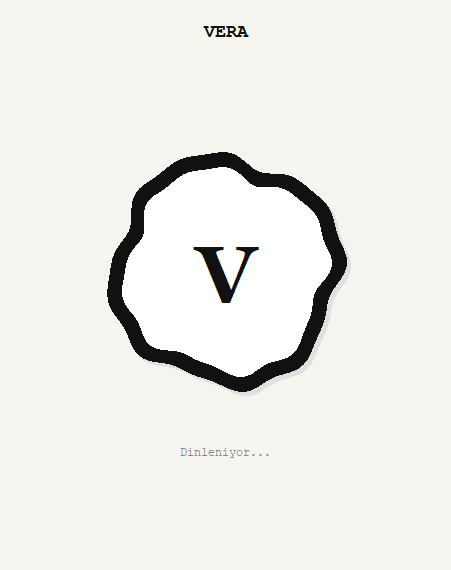
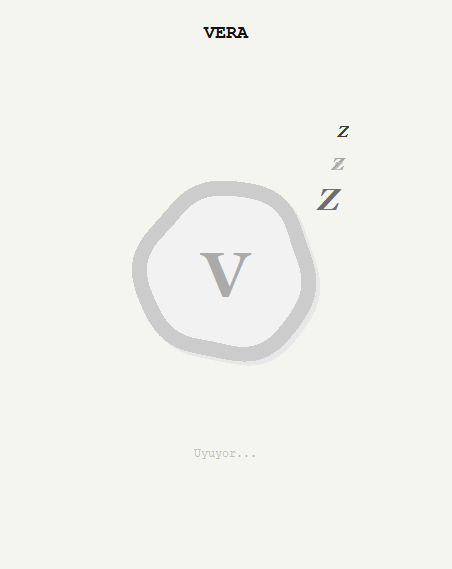

<h1 align="center">🎙️ Vera</h1>
<p align="center">A Turkish-speaking desktop voice assistant built with Python &amp; Tkinter — controls Spotify, smart bulbs and your system, checks the weather, launches apps, and chats using an LLM.</p>
<p align="center">Python ve Tkinter ile geliştirilmiş, Türkçe konuşan bir masaüstü sesli asistanı — Spotify, akıllı ampul ve sistem kontrolü yapar, hava durumuna bakar, uygulama açar ve bir LLM ile sohbet eder.</p>

<p align="center">
  
  
  
  
  
  
</p>

<p align="center">
  <a href="#-english">🌐 English</a> •
  <a href="#-türkçe">🇹🇷 Türkçe</a>
</p>

> 🚧 This is version 1.0 — actively under development, more features and improvements are on the way.
> 🚧 Bu, 1.0 sürümüdür — aktif olarak geliştiriliyor, yeni özellikler ve iyileştirmeler yolda.

---

<br>

<!-- 🌍 ENGLISH SECTION -->
<h1 align="center" id="-english">🌐 English</h1>
<hr>

## 📖 About

**Vera** is a Turkish-language desktop voice assistant written in vanilla Python. It listens through the microphone, understands commands in natural Turkish, speaks back with a natural-sounding TTS voice, and shows an animated Tkinter orb while it listens/talks. Anything that isn't a recognized command (lights, music, system actions, weather, apps) is forwarded to an LLM (via Groq) for general conversation.

## ✨ Features

- 🗣️ **Voice control** — wake/sleep and background listening modes, speech recognition and natural Turkish text-to-speech
- 🎵 **Spotify control** — play/pause, search & play a track, volume, "what's playing", opening the Spotify app, and automatic volume ducking while Vera talks
- 💡 **Smart bulb control** — Tuya smart bulb on/off, color and brightness, via local network
- 🖥️ **System control** — shutdown/restart/sleep/lock (with confirmation window), volume, screenshots, monitor extend/duplicate/second-only, task manager, notification center, file explorer
- 🚀 **App launcher** — opens desktop apps by voice command
- ⛅ **Weather** — current weather for any Turkish city/district via OpenWeatherMap
- 💬 **General chat** — falls back to an LLM (Groq) for anything that isn't a recognized command, with Turkish chat history stored in MySQL
- 🎨 **Animated GUI** — a minimal, animated Tkinter orb that reacts to listening/speaking state

## 🛠️ Tech Stack

- **Python 3** — core language
- **Tkinter** — desktop GUI
- **pygame** — audio playback engine
- **edge-tts** — Turkish text-to-speech
- **SpeechRecognition + PyAudio** — microphone capture & speech-to-text
- **Groq API** — LLM-based general conversation
- **Spotify Web API** — playback control
- **TinyTuya** — local control of the Tuya smart bulb
- **MySQL** — chat history & contacts storage
- **OpenWeatherMap API** — weather data

## 📸 Screenshots

<p align="center">
  
  
</p>

## ⚙️ How it works

`main.py` is the only entry point and stays at the project root; it boots the audio engine and starts the Tkinter GUI. Everything else is split into four packages by responsibility:

- **`gui/`** — the Tkinter window and animated orb (`gui.py`)
- **`core/`** — settings/constants (`config.py`), command routing & LLM fallback (`commands.py`), MySQL access (`database.py`), text helpers (`utils.py`)
- **`controllers/`** — everything that controls an external device or the OS: Spotify (`spotify_controller.py`), the smart bulb (`bulb_controller.py`), Windows (`system_control.py`), app launching (`app_launcher.py`)
- **`services/`** — speech I/O (`speech.py`) and weather lookup (`weather.py`)

Secrets (API keys, DB password) are read from environment variables via `python-dotenv` — see [Usage](#-usage) below.

## 📁 Project Structure

```
Vera/
├── main.py             # Entry point
├── gui/                # Tkinter GUI
│   └── gui.py
├── core/                # Settings, command routing, DB, helpers
│   ├── config.py
│   ├── commands.py
│   ├── database.py
│   └── utils.py
├── controllers/         # Spotify, smart bulb, system, app launcher
│   ├── spotify_controller.py
│   ├── bulb_controller.py
│   ├── system_control.py
│   └── app_launcher.py
├── services/            # Speech (TTS/STT) and weather
│   ├── speech.py
│   └── weather.py
├── img/                 # Screenshots
├── .env.example
├── requirements.txt
├── LICENSE
└── README.md
```

## 🚀 Usage

1. Clone the repository
   ```bash
   git clone https://github.com/<your-username>/Vera.git
   cd Vera
   ```
2. Install dependencies (Python 3.10+ recommended)
   ```bash
   pip install -r requirements.txt
   ```
3. Copy `.env.example` to `.env` and fill in your own keys (Groq, OpenWeatherMap, Spotify, Tuya bulb, MySQL):
   ```bash
   cp .env.example .env
   ```
4. Create a MySQL database matching your `.env` (`DB_NAME`, default `vera_db`).
5. Run it:
   ```bash
   python main.py
   ```

## 🤝 Contributing

1. Fork the repository
2. Create a new branch
3. Commit your changes
4. Push the branch
5. Open a pull request

## 📝 License

This project is licensed under the [MIT License](LICENSE).

<br><br><br><br>

<!-- 🇹🇷 TURKISH SECTION -->
<h1 align="center" id="-türkçe">🇹🇷 Türkçe</h1>
<hr>

## 📖 Hakkında

**Vera**, saf Python ile yazılmış, Türkçe konuşan bir masaüstü sesli asistanıdır. Mikrofondan dinler, doğal Türkçe komutları anlar, doğal bir TTS sesiyle cevap verir ve dinlerken/konuşurken animasyonlu bir Tkinter küresi gösterir. Tanınan bir komut olmayan her şey (ışıklar, müzik, sistem işlemleri, hava durumu, uygulamalar dışında kalan konular) genel sohbet için bir LLM'e (Groq üzerinden) yönlendirilir.

## ✨ Özellikler

- 🗣️ **Sesli kontrol** — uyanma/uyuma ve arka planda dinleme modları, konuşma tanıma ve doğal Türkçe seslendirme
- 🎵 **Spotify kontrolü** — çal/duraklat, şarkı arama & çalma, ses seviyesi, "ne çalıyor", Spotify uygulamasını açma ve Vera konuşurken otomatik ses kısma
- 💡 **Akıllı ampul kontrolü** — Tuya akıllı ampulü yerel ağ üzerinden açma/kapama, renk ve parlaklık ayarı
- 🖥️ **Sistem kontrolü** — kapat/yeniden başlat/uyut/kilitle (onay penceresiyle), ses seviyesi, ekran görüntüsü, monitör genişlet/kopyala/sadece ikinci ekran, görev yöneticisi, bildirim merkezi, dosya gezgini
- 🚀 **Uygulama açıcı** — sesli komutla masaüstü uygulamalarını açar
- ⛅ **Hava durumu** — OpenWeatherMap üzerinden herhangi bir Türkiye il/ilçesi için güncel hava durumu
- 💬 **Genel sohbet** — tanınan bir komut olmayan her şey için bir LLM'e (Groq) düşer, Türkçe sohbet geçmişi MySQL'de tutulur
- 🎨 **Animasyonlu arayüz** — dinleme/konuşma durumuna tepki veren minimal, animasyonlu bir Tkinter küresi

## 🛠️ Kullanılan Teknolojiler

- **Python 3** — ana dil
- **Tkinter** — masaüstü arayüzü
- **pygame** — ses çalma motoru
- **edge-tts** — Türkçe metinden sese dönüşüm
- **SpeechRecognition + PyAudio** — mikrofon yakalama & sesten metne dönüşüm
- **Groq API** — LLM tabanlı genel sohbet
- **Spotify Web API** — oynatma kontrolü
- **TinyTuya** — Tuya akıllı ampulün yerel kontrolü
- **MySQL** — sohbet geçmişi & kişi kayıtları
- **OpenWeatherMap API** — hava durumu verisi

## 📸 Ekran Görüntüleri

<p align="center">
  
  
</p>

## ⚙️ Nasıl Çalışıyor

`main.py`, tek giriş noktasıdır ve projenin kök dizininde kalır; ses motorunu başlatır ve Tkinter arayüzünü açar. Geri kalan her şey sorumluluğa göre dört pakete ayrılmıştır:

- **`gui/`** — Tkinter penceresi ve animasyonlu küre (`gui.py`)
- **`core/`** — ayarlar/sabitler (`config.py`), komut yönlendirme & LLM'e düşme (`commands.py`), MySQL erişimi (`database.py`), metin yardımcıları (`utils.py`)
- **`controllers/`** — harici bir cihazı veya işletim sistemini kontrol eden her şey: Spotify (`spotify_controller.py`), akıllı ampul (`bulb_controller.py`), Windows (`system_control.py`), uygulama açma (`app_launcher.py`)
- **`services/`** — ses giriş/çıkışı (`speech.py`) ve hava durumu sorgusu (`weather.py`)

Gizli bilgiler (API anahtarları, DB şifresi) `python-dotenv` ile ortam değişkenlerinden okunur — aşağıdaki [Kullanım](#-kullanım) bölümüne bakın.

## 📁 Proje Yapısı

```
Vera/
├── main.py             # Giriş noktası
├── gui/                # Tkinter arayüzü
│   └── gui.py
├── core/                # Ayarlar, komut yönlendirme, DB, yardımcılar
│   ├── config.py
│   ├── commands.py
│   ├── database.py
│   └── utils.py
├── controllers/         # Spotify, akıllı ampul, sistem, uygulama açıcı
│   ├── spotify_controller.py
│   ├── bulb_controller.py
│   ├── system_control.py
│   └── app_launcher.py
├── services/            # Ses (TTS/STT) ve hava durumu
│   ├── speech.py
│   └── weather.py
├── img/                 # Ekran görüntüleri
├── .env.example
├── requirements.txt
├── LICENSE
└── README.md
```

## 🚀 Kullanım

1. Depoyu klonlayın
   ```bash
   git clone https://github.com/<kullanici-adiniz>/Vera.git
   cd Vera
   ```
2. Bağımlılıkları kurun (Python 3.10+ önerilir)
   ```bash
   pip install -r requirements.txt
   ```
3. `.env.example` dosyasını `.env` olarak kopyalayıp kendi anahtarlarınızı girin (Groq, OpenWeatherMap, Spotify, Tuya ampul, MySQL):
   ```bash
   cp .env.example .env
   ```
4. `.env` dosyanızla eşleşen bir MySQL veritabanı oluşturun (`DB_NAME`, varsayılan `vera_db`).
5. Çalıştırın:
   ```bash
   python main.py
   ```

## 🤝 Katkıda Bulunma

1. Projeyi fork'layın
2. Yeni bir branch oluşturun
3. Değişikliklerinizi commit edin
4. Branch'i push edin
5. Pull request oluşturun

## 📝 Lisans

Bu proje [MIT Lisansı](LICENSE) ile lisanslanmıştır.
